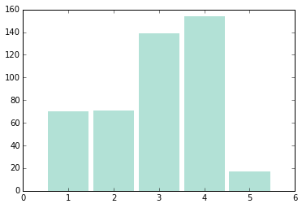

# Milano Strutture Ricettive Alberghi 2013

I dati utilizzati sono quelli del comune di Milano, disponibili sul sito:
http://dati.comune.milano.it/

    import pandas as pd
    
    CSV_FILE = 'StruttureRicettAlbergh-2013.csv'

    df = pd.read_csv(CSV_FILE, sep=';')
    df.head()

<table border="1" class="dataframe">
  <thead>
    <tr style="text-align: right;">
      <th></th>
      <th>Zona</th>
      <th>Nil</th>
      <th>Tipologia esercizio</th>
      <th>Insegna</th>
      <th>Indirizzo</th>
      <th>Categoria (stelle)</th>
      <th>Numero camere</th>
      <th>Numero posti letto</th>
    </tr>
  </thead>
  <tbody>
    <tr>
      <th>0</th>
      <td> 1</td>
      <td> 1</td>
      <td> Albergo</td>
      <td>    Boscolo Hotel Exedra</td>
      <td> Cso Matteotti Giacomo, 4/6</td>
      <td> 5</td>
      <td> 154</td>
      <td> 308</td>
    </tr>
    <tr>
      <th>1</th>
      <td> 1</td>
      <td> 1</td>
      <td> Albergo</td>
      <td>  Carlton Hotel Baglioni</td>
      <td>              Via Senato, 5</td>
      <td> 5</td>
      <td>  93</td>
      <td> 186</td>
    </tr>
    <tr>
      <th>2</th>
      <td> 1</td>
      <td> 1</td>
      <td> Albergo</td>
      <td> Four Season Hotel Milan</td>
      <td>              Via Gesu', 10</td>
      <td> 5</td>
      <td> 118</td>
      <td> 240</td>
    </tr>
    <tr>
      <th>3</th>
      <td> 1</td>
      <td> 1</td>
      <td> Albergo</td>
      <td>     Hotel Pierre Milano</td>
      <td>  Via De Amicis Edmondo, 32</td>
      <td> 5</td>
      <td>  47</td>
      <td>  92</td>
    </tr>
    <tr>
      <th>4</th>
      <td> 1</td>
      <td> 1</td>
      <td> Albergo</td>
      <td>       Park Hyatt Milano</td>
      <td>      Via Grossi Tommaso, 1</td>
      <td> 5</td>
      <td> 106</td>
      <td> 212</td>
    </tr>
  </tbody>
</table>

    df.describe()

<table border="1" class="dataframe">
  <thead>
    <tr style="text-align: right;">
      <th></th>
      <th>Zona</th>
      <th>Nil</th>
      <th>Categoria (stelle)</th>
      <th>Numero camere</th>
      <th>Numero posti letto</th>
    </tr>
  </thead>
  <tbody>
    <tr>
      <th>count</th>
      <td> 451.000000</td>
      <td> 451.000000</td>
      <td> 451.000000</td>
      <td> 451.000000</td>
      <td> 451.000000</td>
    </tr>
    <tr>
      <th>mean</th>
      <td>   4.113082</td>
      <td>  27.299335</td>
      <td>   2.949002</td>
      <td>  60.447894</td>
      <td> 114.660754</td>
    </tr>
    <tr>
      <th>std</th>
      <td>   2.675499</td>
      <td>  23.046937</td>
      <td>   1.127265</td>
      <td>  69.140011</td>
      <td> 137.748169</td>
    </tr>
    <tr>
      <th>min</th>
      <td>   1.000000</td>
      <td>   1.000000</td>
      <td>   1.000000</td>
      <td>   7.000000</td>
      <td>   7.000000</td>
    </tr>
    <tr>
      <th>25%</th>
      <td>   2.000000</td>
      <td>  10.000000</td>
      <td>   2.000000</td>
      <td>  16.000000</td>
      <td>  25.000000</td>
    </tr>
    <tr>
      <th>50%</th>
      <td>   3.000000</td>
      <td>  21.000000</td>
      <td>   3.000000</td>
      <td>  35.000000</td>
      <td>  67.000000</td>
    </tr>
    <tr>
      <th>75%</th>
      <td>   7.000000</td>
      <td>  43.500000</td>
      <td>   4.000000</td>
      <td>  75.000000</td>
      <td> 146.000000</td>
    </tr>
    <tr>
      <th>max</th>
      <td>   9.000000</td>
      <td>  88.000000</td>
      <td>   5.000000</td>
      <td> 439.000000</td>
      <td> 922.000000</td>
    </tr>
  </tbody>
</table>

    import thinkstats2
    import thinkplot

## Distribuzione Categoria (stelle)

    df = df.rename(columns={'Categoria (stelle)': 'stelle'})
    stars = df['stelle']
    
    hist_stars = thinkstats2.Hist(stars, label='Stelle')

    thinkplot.Hist(hist_stars)

    stars.describe()

    count    451.000000
    mean       2.949002
    std        1.127265
    min        1.000000
    25%        2.000000
    50%        3.000000
    75%        4.000000
    max        5.000000
    Name: stelle, dtype: float64

## Posti letto

    df = df.rename(columns={'Numero posti letto': 'posti'})
    
    posti = df['posti']
    
    posti.describe()

    count    451.000000
    mean     114.660754
    std      137.748169
    min        7.000000
    25%       25.000000
    50%       67.000000
    75%      146.000000
    max      922.000000
    Name: posti, dtype: float64

## Tipologia Struttura

    df = df.rename(columns={'Tipologia esercizio': 'tipo'})
    
    df['tipo'] = df['tipo'].apply(lambda x: x[0].upper() + x[1:], 1)
    
    types = df.groupby(['tipo'])
    
    from IPython.display import HTML
    
    for i, type in types:
        display(HTML("<li>%s - <b>%d</b></li>" %(i, len(type))))

<li>Albergo - <b>397</b></li>

<li>Residence - <b>54</b></li>

    
