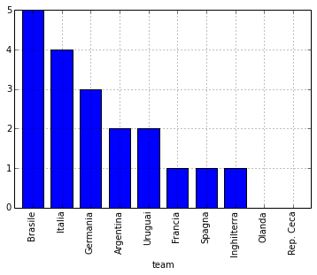
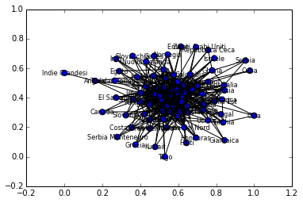

# World cup

    import pandas as pd
    from IPython.core.display import HTML

    def show_best_team(teamA, teamB, data):

        totA = data[data.team == teamA ]['tot']
        totB = data[data.team == teamB]['tot']

        totA = int(totA) if len(totA)>0 else 0
        totB = int(totB) if len(totB)>0 else 0

        if totA > totB:
            print '%s won %d medals while %s won %d medals' % (teamA, totA, teamB, totB)
        else:
            print '%s won %d medals while %s won %d medals' % (teamB, totB, teamA, totA)

    def show_best_winner(teamA, teamB, data):
        totA = data[data.team == teamA ]['first']
        totB = data[data.team == teamB]['first']

        totA = int(totA) if len(totA)>0 else 0
        totB = int(totB) if len(totB)>0 else 0

        if totA > totB:
            return '%s won %d championships while %s won %d championships' % (teamA, totA, teamB, totB)
        else:
            return '%s won %d championships while %s won %d championships' % (teamB, totB, teamA, totA)

    medals = pd.read_csv("medals.csv")
    medals.columns = ['team', 'first', 'second', 'third', 'fourth', 'tot']
    HTML("<b>Best teams in soccer world cups</b>")

    # text = show_best_team(teamA, teamB, medals)
    # text = show_best_winner(teamA, teamB, medals)

<b>Best teams in soccer world cups</b>

    medals.head()

<table border="1" class="dataframe">
  <thead>
    <tr style="text-align: right;">
      <th></th>
      <th>team</th>
      <th>first</th>
      <th>second</th>
      <th>third</th>
      <th>fourth</th>
      <th>tot</th>
    </tr>
  </thead>
  <tbody>
    <tr>
      <th>0</th>
      <td>   Brasile</td>
      <td> 5</td>
      <td> 2</td>
      <td> 2</td>
      <td> 1</td>
      <td> 10</td>
    </tr>
    <tr>
      <th>1</th>
      <td>    Italia</td>
      <td> 4</td>
      <td> 2</td>
      <td> 1</td>
      <td> 1</td>
      <td>  8</td>
    </tr>
    <tr>
      <th>2</th>
      <td>  Germania</td>
      <td> 3</td>
      <td> 4</td>
      <td> 4</td>
      <td> 1</td>
      <td> 12</td>
    </tr>
    <tr>
      <th>3</th>
      <td> Argentina</td>
      <td> 2</td>
      <td> 2</td>
      <td> 0</td>
      <td> 0</td>
      <td>  4</td>
    </tr>
    <tr>
      <th>4</th>
      <td>   Uruguai</td>
      <td> 2</td>
      <td> 0</td>
      <td> 0</td>
      <td> 3</td>
      <td>  5</td>
    </tr>
  </tbody>
</table>

5 rows × 6 columns

    s = pd.Series(medals['first'][:10].values, index=medals['team'][:10])
    s.plot(kind='bar')
    plt.show()

### world cup history

    # data.head()
    def show_team_history(team):
        team_hist = pd.concat(
            (data[data.firstp == team],
             data[data.secodp == team],
             data[data.thirdp == team],
             data[data.fourthp == team])
        )

        if not team_hist.empty:

            print '%s History in the world cup' %team
            return team_hist.sort(['Year'])

    # show_team_history(teamA)
    data = pd.read_csv("history.csv")
    data

<table border="1" class="dataframe">
  <thead>
    <tr style="text-align: right;">
      <th></th>
      <th>Year</th>
      <th>Country</th>
      <th>firstp</th>
      <th>secodp</th>
      <th>thirdp</th>
      <th>fourthp</th>
    </tr>
  </thead>
  <tbody>
    <tr>
      <th>0 </th>
      <td> 1930</td>
      <td>                   Uruguai</td>
      <td>     Uruguai</td>
      <td>      Argentina</td>
      <td>        USA</td>
      <td>    Jugoslavia</td>
    </tr>
    <tr>
      <th>1 </th>
      <td> 1934</td>
      <td>                    Italia</td>
      <td>      Italia</td>
      <td> Cecoslovacchia</td>
      <td>   Germania</td>
      <td>       Austria</td>
    </tr>
    <tr>
      <th>2 </th>
      <td> 1938</td>
      <td>                   Francia</td>
      <td>      Italia</td>
      <td>       Ungheria</td>
      <td>    Brasile</td>
      <td>        Svezia</td>
    </tr>
    <tr>
      <th>3 </th>
      <td> 1950</td>
      <td>                   Brasile</td>
      <td>     Uruguai</td>
      <td>        Brasile</td>
      <td>     Svezia</td>
      <td>        Spagna</td>
    </tr>
    <tr>
      <th>4 </th>
      <td> 1954</td>
      <td>                  Svizzera</td>
      <td>    Germania</td>
      <td>       Ungheria</td>
      <td>    Austria</td>
      <td>       Uruguai</td>
    </tr>
    <tr>
      <th>5 </th>
      <td> 1958</td>
      <td>                    Svezia</td>
      <td>     Brasile</td>
      <td>         Svezia</td>
      <td>    Francia</td>
      <td>      Germania</td>
    </tr>
    <tr>
      <th>6 </th>
      <td> 1962</td>
      <td>                      Cile</td>
      <td>     Brasile</td>
      <td> Cecoslovacchia</td>
      <td>       Cile</td>
      <td>    Jugoslavia</td>
    </tr>
    <tr>
      <th>7 </th>
      <td> 1966</td>
      <td>               Inghilterra</td>
      <td> Inghilterra</td>
      <td>       Germania</td>
      <td> Portogallo</td>
      <td>          URSS</td>
    </tr>
    <tr>
      <th>8 </th>
      <td> 1970</td>
      <td>                   Messico</td>
      <td>     Brasile</td>
      <td>         Italia</td>
      <td>   Germania</td>
      <td>       Uruguai</td>
    </tr>
    <tr>
      <th>9 </th>
      <td> 1974</td>
      <td>                  Germania</td>
      <td>    Germania</td>
      <td>         Olanda</td>
      <td>    Polonia</td>
      <td>       Brasile</td>
    </tr>
    <tr>
      <th>10</th>
      <td> 1978</td>
      <td>                 Argentina</td>
      <td>   Argentina</td>
      <td>         Olanda</td>
      <td>    Brasile</td>
      <td>        Italia</td>
    </tr>
    <tr>
      <th>11</th>
      <td> 1982</td>
      <td>                    Spagna</td>
      <td>      Italia</td>
      <td>       Germania</td>
      <td>    Polonia</td>
      <td>       Francia</td>
    </tr>
    <tr>
      <th>12</th>
      <td> 1986</td>
      <td>                   Messico</td>
      <td>   Argentina</td>
      <td>       Germania</td>
      <td>    Francia</td>
      <td>        Belgio</td>
    </tr>
    <tr>
      <th>13</th>
      <td> 1990</td>
      <td>                    Italia</td>
      <td>    Germania</td>
      <td>      Argentina</td>
      <td>     Italia</td>
      <td>   Inghilterra</td>
    </tr>
    <tr>
      <th>14</th>
      <td> 1994</td>
      <td>                       USA</td>
      <td>     Brasile</td>
      <td>         Italia</td>
      <td>     Svezia</td>
      <td>      Bulgaria</td>
    </tr>
    <tr>
      <th>15</th>
      <td> 1998</td>
      <td>                   Francia</td>
      <td>     Francia</td>
      <td>        Brasile</td>
      <td>    Croazia</td>
      <td>        Olanda</td>
    </tr>
    <tr>
      <th>16</th>
      <td> 2002</td>
      <td> Corea del Sud\n\nGiappone</td>
      <td>     Brasile</td>
      <td>       Germania</td>
      <td>    Turchia</td>
      <td> Corea del Sud</td>
    </tr>
    <tr>
      <th>17</th>
      <td> 2006</td>
      <td>                  Germania</td>
      <td>      Italia</td>
      <td>        Francia</td>
      <td>   Germania</td>
      <td>    Portogallo</td>
    </tr>
    <tr>
      <th>18</th>
      <td> 2010</td>
      <td>                 Sudafrica</td>
      <td>      Spagna</td>
      <td>         Olanda</td>
      <td>   Germania</td>
      <td>       Uruguai</td>
    </tr>
  </tbody>
</table>

19 rows × 6 columns

    HTML('The first world cup was held in <b>%s</b> \
         The last was in <b>%s</b>' % (int(data.head(1).Year), int(data.tail(1).Year)))

The first world cup was held in <b>1930</b>      The last was in <b>2010</b>

    # Read the teams and for each team get the medals and the number of victories

    teams = pd.read_csv("teams.csv")
    # merging dataframe: team with medals
    team_and_medals = pd.merge(teams, medals, how='left', on='team')

    HTML('Teams in <b>2014</b> world cup and their position in the medals ranking.')
    #for t in teams.index:
        # print teams.ix[t].team
        # for each team get the num of medals
        #    m = medals[medals.team == teams.ix[t].team]

Teams in <b>2014</b> world cup and their position in the medals ranking.

    team_and_medals.fillna(0).sort(['tot'], ascending=(0)).head(15)

<table border="1" class="dataframe">
  <thead>
    <tr style="text-align: right;">
      <th></th>
      <th>team</th>
      <th>first</th>
      <th>second</th>
      <th>third</th>
      <th>fourth</th>
      <th>tot</th>
    </tr>
  </thead>
  <tbody>
    <tr>
      <th>15</th>
      <td>      Germania</td>
      <td> 3</td>
      <td> 4</td>
      <td> 4</td>
      <td> 1</td>
      <td> 12</td>
    </tr>
    <tr>
      <th>5 </th>
      <td>       Brasile</td>
      <td> 5</td>
      <td> 2</td>
      <td> 2</td>
      <td> 1</td>
      <td> 10</td>
    </tr>
    <tr>
      <th>22</th>
      <td>        Italia</td>
      <td> 4</td>
      <td> 2</td>
      <td> 1</td>
      <td> 1</td>
      <td>  8</td>
    </tr>
    <tr>
      <th>14</th>
      <td>       Francia</td>
      <td> 1</td>
      <td> 1</td>
      <td> 2</td>
      <td> 1</td>
      <td>  5</td>
    </tr>
    <tr>
      <th>1 </th>
      <td>     Argentina</td>
      <td> 2</td>
      <td> 2</td>
      <td> 0</td>
      <td> 0</td>
      <td>  4</td>
    </tr>
    <tr>
      <th>25</th>
      <td>        Olanda</td>
      <td> 0</td>
      <td> 3</td>
      <td> 0</td>
      <td> 1</td>
      <td>  4</td>
    </tr>
    <tr>
      <th>20</th>
      <td>   Inghilterra</td>
      <td> 1</td>
      <td> 0</td>
      <td> 0</td>
      <td> 1</td>
      <td>  2</td>
    </tr>
    <tr>
      <th>28</th>
      <td>        Spagna</td>
      <td> 1</td>
      <td> 0</td>
      <td> 0</td>
      <td> 1</td>
      <td>  2</td>
    </tr>
    <tr>
      <th>26</th>
      <td>    Portogallo</td>
      <td> 0</td>
      <td> 0</td>
      <td> 1</td>
      <td> 1</td>
      <td>  2</td>
    </tr>
    <tr>
      <th>9 </th>
      <td> Corea del Sud</td>
      <td> 0</td>
      <td> 0</td>
      <td> 0</td>
      <td> 1</td>
      <td>  1</td>
    </tr>
    <tr>
      <th>7 </th>
      <td>          Cile</td>
      <td> 0</td>
      <td> 0</td>
      <td> 1</td>
      <td> 0</td>
      <td>  1</td>
    </tr>
    <tr>
      <th>12</th>
      <td>       Croazia</td>
      <td> 0</td>
      <td> 0</td>
      <td> 1</td>
      <td> 0</td>
      <td>  1</td>
    </tr>
    <tr>
      <th>3 </th>
      <td>        Belgio</td>
      <td> 0</td>
      <td> 0</td>
      <td> 0</td>
      <td> 1</td>
      <td>  1</td>
    </tr>
    <tr>
      <th>27</th>
      <td>        Russia</td>
      <td> 0</td>
      <td> 0</td>
      <td> 0</td>
      <td> 1</td>
      <td>  1</td>
    </tr>
    <tr>
      <th>11</th>
      <td>    Costa Rica</td>
      <td> 0</td>
      <td> 0</td>
      <td> 0</td>
      <td> 0</td>
      <td>  0</td>
    </tr>
  </tbody>
</table>

15 rows × 6 columns

    cal = pd.read_csv("calendar.csv")

    def show_matches(team_a, team_b):
            metches_ab = cal[cal.team_a == team_a][cal.team_b == team_b]
            metches_ba = cal[cal.team_a == team_b][cal.team_a == team_a]

            metches = pd.concat((metches_ab, metches_ba))

            if not metches.empty:
                print '%s and %s direct metches.' %(team_a, team_b)
                return metches
            else:
                print '%s and %s never met before' %(team_a, team_b)

    HTML('All matches so far ....')

All matches so far ....

    cal.head()

<table border="1" class="dataframe">
  <thead>
    <tr style="text-align: right;">
      <th></th>
      <th>date</th>
      <th>team_a</th>
      <th>team_b</th>
      <th>result</th>
    </tr>
  </thead>
  <tbody>
    <tr>
      <th>0</th>
      <td> 13/07/30</td>
      <td>    Francia</td>
      <td> Messico</td>
      <td> 4-1</td>
    </tr>
    <tr>
      <th>1</th>
      <td> 13/07/30</td>
      <td>        USA</td>
      <td>  Belgio</td>
      <td> 3-0</td>
    </tr>
    <tr>
      <th>2</th>
      <td> 14/07/30</td>
      <td> Yugoslavia</td>
      <td> Brasile</td>
      <td> 2-1</td>
    </tr>
    <tr>
      <th>3</th>
      <td> 14/07/30</td>
      <td>    Romania</td>
      <td>     Per</td>
      <td> 3-1</td>
    </tr>
    <tr>
      <th>4</th>
      <td> 15/07/30</td>
      <td>  Argentina</td>
      <td> Francia</td>
      <td> 1-0</td>
    </tr>
  </tbody>
</table>

5 rows × 4 columns

    import networkx as nx
    G=nx.Graph()

    for r in cal.index:

        G.add_edge(cal.ix[r].team_a, cal.ix[r].team_b)
        #print calendar.ix[r].team_a, calendar.ix[r].team_b

    nx.draw_networkx(G, node_size=50, node_color='b', font_size=8 ,label='World cup past matches')

    plt.show()

    print 'Network diameter:', nx.diameter(G)
    # The diameter is the maximum eccentricity among all nodes.
    # The eccentricity of a node v is the maximum distance from v to all other nodes in G.

    print
    print 'Betweeness Centrality'
    betweenness_centrality = nx.betweenness_centrality(G)
    for w in sorted(betweenness_centrality, key=betweenness_centrality.get, reverse=True)[:10]:
        print w, betweenness_centrality[w]

    Network diameter: 3

    Betweeness Centrality

    Brasile 0.123351914014
    Germania 0.102325396665
    Italia 0.083260275077
    Argentina 0.0717771603579
    Messico 0.057632943563
    Inghilterra 0.0562684585788
    Svezia 0.0514433365071
    Olanda 0.0466145976928
    Francia 0.0456625207253
    Ungheria 0.0419517000304

    players = pd.read_csv("players.csv", sep='\t')
    HTML('<b>Players</b> in 2014 tournament.')

<b>Players</b> in 2014 tournament.

    players.head()

<table border="1" class="dataframe">
  <thead>
    <tr style="text-align: right;">
      <th></th>
      <th>Pos</th>
      <th>Giocatore</th>
      <th>eta</th>
      <th>Pres</th>
      <th>Gol</th>
      <th>Nazionale</th>
    </tr>
  </thead>
  <tbody>
    <tr>
      <th>0</th>
      <td> P</td>
      <td>       Manuel Neuer</td>
      <td> 28</td>
      <td>  45</td>
      <td> 0</td>
      <td> Germania</td>
    </tr>
    <tr>
      <th>1</th>
      <td> P</td>
      <td> Roman Weidenfeller</td>
      <td> 33</td>
      <td>   1</td>
      <td> 0</td>
      <td> Germania</td>
    </tr>
    <tr>
      <th>2</th>
      <td> D</td>
      <td>       Philipp Lahm</td>
      <td> 30</td>
      <td> 105</td>
      <td> 5</td>
      <td> Germania</td>
    </tr>
    <tr>
      <th>3</th>
      <td> D</td>
      <td>    Per Mertesacker</td>
      <td> 29</td>
      <td>  96</td>
      <td> 4</td>
      <td> Germania</td>
    </tr>
    <tr>
      <th>4</th>
      <td> D</td>
      <td>     Marcell Jansen</td>
      <td> 28</td>
      <td>  45</td>
      <td> 3</td>
      <td> Germania</td>
    </tr>
  </tbody>
</table>

5 rows × 6 columns

    # older and younger player
    #players.ix[players['eta'].argmax()]
    HTML('Older Players.')

Older Players.

    players.sort(['eta'], ascending=[0])[:5]

<table border="1" class="dataframe">
  <thead>
    <tr style="text-align: right;">
      <th></th>
      <th>Pos</th>
      <th>Giocatore</th>
      <th>eta</th>
      <th>Pres</th>
      <th>Gol</th>
      <th>Nazionale</th>
    </tr>
  </thead>
  <tbody>
    <tr>
      <th>184</th>
      <td> P</td>
      <td>    Noel Valladares</td>
      <td> 37</td>
      <td> 120</td>
      <td>   0</td>
      <td>       Honduras</td>
    </tr>
    <tr>
      <th>174</th>
      <td> C</td>
      <td> Giorgos Karagounis</td>
      <td> 37</td>
      <td> 132</td>
      <td>  10</td>
      <td>         Grecia</td>
    </tr>
    <tr>
      <th>158</th>
      <td> A</td>
      <td>      Didier Drogba</td>
      <td> 36</td>
      <td>  99</td>
      <td>  63</td>
      <td> Costa d’Avorio</td>
    </tr>
    <tr>
      <th>259</th>
      <td> D</td>
      <td>  Daniel Van Buyten</td>
      <td> 36</td>
      <td>  77</td>
      <td>  10</td>
      <td>         Belgio</td>
    </tr>
    <tr>
      <th>107</th>
      <td> P</td>
      <td>   Gianluigi Buffon</td>
      <td> 36</td>
      <td> 139</td>
      <td>-114</td>
      <td>         Italia</td>
    </tr>
  </tbody>
</table>

5 rows × 6 columns

    HTML('Younger Players')

Younger Players

    players.sort(['eta'], ascending=[1])[:5]

<table border="1" class="dataframe">
  <thead>
    <tr style="text-align: right;">
      <th></th>
      <th>Pos</th>
      <th>Giocatore</th>
      <th>eta</th>
      <th>Pres</th>
      <th>Gol</th>
      <th>Nazionale</th>
    </tr>
  </thead>
  <tbody>
    <tr>
      <th>648</th>
      <td> D</td>
      <td>    Frank Bagnack</td>
      <td> 18</td>
      <td> 0</td>
      <td> 0</td>
      <td>     Camerun</td>
    </tr>
    <tr>
      <th>398</th>
      <td> D</td>
      <td>        Luke Shaw</td>
      <td> 18</td>
      <td> 1</td>
      <td> 0</td>
      <td> Inghilterra</td>
    </tr>
    <tr>
      <th>273</th>
      <td> C</td>
      <td>    Adnan Januzaj</td>
      <td> 19</td>
      <td> 0</td>
      <td> 0</td>
      <td>      Belgio</td>
    </tr>
    <tr>
      <th>555</th>
      <td> D</td>
      <td>     José Giménez</td>
      <td> 19</td>
      <td> 4</td>
      <td> 0</td>
      <td>     Uruguai</td>
    </tr>
    <tr>
      <th>287</th>
      <td> D</td>
      <td> Cristian Ramírez</td>
      <td> 19</td>
      <td> 2</td>
      <td> 0</td>
      <td>     Ecuador</td>
    </tr>
  </tbody>
</table>

5 rows × 6 columns

    HTML('Best scorer')

Best scorer

    # best scorer
    # players.ix[players['Gol'].argmax()]
    # compute a rate as GOL / Pres
    players.sort(['Gol'], ascending=[0])[:5]

<table border="1" class="dataframe">
  <thead>
    <tr style="text-align: right;">
      <th></th>
      <th>Pos</th>
      <th>Giocatore</th>
      <th>eta</th>
      <th>Pres</th>
      <th>Gol</th>
      <th>Nazionale</th>
    </tr>
  </thead>
  <tbody>
    <tr>
      <th>18 </th>
      <td> A</td>
      <td>    Miroslav Klose</td>
      <td> 35</td>
      <td> 131</td>
      <td> 68</td>
      <td>       Germania</td>
    </tr>
    <tr>
      <th>158</th>
      <td> A</td>
      <td>     Didier Drogba</td>
      <td> 36</td>
      <td>  99</td>
      <td> 63</td>
      <td> Costa d’Avorio</td>
    </tr>
    <tr>
      <th>654</th>
      <td> A</td>
      <td>      Samuel Eto'o</td>
      <td> 33</td>
      <td> 115</td>
      <td> 55</td>
      <td>        Camerun</td>
    </tr>
    <tr>
      <th>588</th>
      <td> A</td>
      <td> Cristiano Ronaldo</td>
      <td> 29</td>
      <td> 110</td>
      <td> 49</td>
      <td>     Portogallo</td>
    </tr>
    <tr>
      <th>10 </th>
      <td> C</td>
      <td>    Lukas Podolski</td>
      <td> 28</td>
      <td> 112</td>
      <td> 46</td>
      <td>       Germania</td>
    </tr>
  </tbody>
</table>

5 rows × 6 columns

    HTML('<b>Best scorer</b> by <b>Rate</b> (Gol / Pres')

<b>Best scorer</b> by <b>Rate</b> (Gol / Pres

    players_who_played = players[players['Pres'] > 0]

    # players_who_played['Rate'] = range(1, len(players_who_played) + 1)

    players_who_played['Rate'] = players_who_played['Gol'] / players_who_played['Pres']
    players_who_played.sort(['Rate'], ascending=[0])[:5]

<table border="1" class="dataframe">
  <thead>
    <tr style="text-align: right;">
      <th></th>
      <th>Pos</th>
      <th>Giocatore</th>
      <th>eta</th>
      <th>Pres</th>
      <th>Gol</th>
      <th>Nazionale</th>
      <th>Rate</th>
    </tr>
  </thead>
  <tbody>
    <tr>
      <th>37 </th>
      <td> A</td>
      <td>         Alan Pulido</td>
      <td> 23</td>
      <td>  3</td>
      <td>  4</td>
      <td>        Messico</td>
      <td> 1.333333</td>
    </tr>
    <tr>
      <th>343</th>
      <td> A</td>
      <td> Reza Ghoochannejhad</td>
      <td> 26</td>
      <td> 11</td>
      <td>  9</td>
      <td>           Iran</td>
      <td> 0.818182</td>
    </tr>
    <tr>
      <th>337</th>
      <td> C</td>
      <td>      Yaghoub Karimi</td>
      <td> 22</td>
      <td>  6</td>
      <td>  4</td>
      <td>           Iran</td>
      <td> 0.666667</td>
    </tr>
    <tr>
      <th>567</th>
      <td> A</td>
      <td>      Abel Hernández</td>
      <td> 23</td>
      <td> 11</td>
      <td>  7</td>
      <td>        Uruguai</td>
      <td> 0.636364</td>
    </tr>
    <tr>
      <th>158</th>
      <td> A</td>
      <td>       Didier Drogba</td>
      <td> 36</td>
      <td> 99</td>
      <td> 63</td>
      <td> Costa d’Avorio</td>
      <td> 0.636364</td>
    </tr>
  </tbody>
</table>

5 rows × 7 columns

    # worst goolkeeper
    #players.ix[players['Gol'].argmin()]
    players.sort(['Gol'], ascending=[1])[:5]

<table border="1" class="dataframe">
  <thead>
    <tr style="text-align: right;">
      <th></th>
      <th>Pos</th>
      <th>Giocatore</th>
      <th>eta</th>
      <th>Pres</th>
      <th>Gol</th>
      <th>Nazionale</th>
    </tr>
  </thead>
  <tbody>
    <tr>
      <th>107</th>
      <td> P</td>
      <td> Gianluigi Buffon</td>
      <td> 36</td>
      <td> 139</td>
      <td>-114</td>
      <td>            Italia</td>
    </tr>
    <tr>
      <th>367</th>
      <td> P</td>
      <td>      Júlio César</td>
      <td> 34</td>
      <td>  76</td>
      <td> -54</td>
      <td>           Brasile</td>
    </tr>
    <tr>
      <th>38 </th>
      <td> P</td>
      <td>    Asmir Begović</td>
      <td> 26</td>
      <td>  28</td>
      <td> -26</td>
      <td> Bosnia Erzegovina</td>
    </tr>
    <tr>
      <th>108</th>
      <td> P</td>
      <td> Salvatore Sirigu</td>
      <td> 27</td>
      <td>   7</td>
      <td>  -8</td>
      <td>            Italia</td>
    </tr>
    <tr>
      <th>368</th>
      <td> P</td>
      <td>           Victor</td>
      <td> 31</td>
      <td>   6</td>
      <td>  -4</td>
      <td>           Brasile</td>
    </tr>
  </tbody>
</table>

5 rows × 6 columns

    HTML('<h3>Group A</h3>')

<h3>Group A</h3>

    # https://it.wikipedia.org/wiki/Campionato_mondiale_di_calcio_2014
    # teamA = 'Brasile'
    # teamB = 'Croazia'
    # teamA = 'Messico'
    # teamB = 'Camerun'
    teamA = 'Brasile'
    teamB = 'Messico'

    print '%s vs %s' % (teamA, teamB)
    teamA_players = players[players.Nazionale == teamA]
    teamB_players = players[players.Nazionale == teamB]

    print 'Mean goal scored by %s players: %f' %(teamA, teamA_players[teamA_players.Pos <> 'P']['Gol'].mean())
    print 'Mean goal scored by %s players: %f' %(teamB, teamB_players[teamB_players.Pos <> 'P']['Gol'].mean())
    print
    # avarage age
    print 'Mean age %s: %f' %(teamA, teamA_players['eta'].mean())
    print 'Mean age %s: %f' %(teamB, teamB_players['eta'].mean())

    Brasile vs Messico
    Mean goal scored by Brasile players: 4.750000
    Mean goal scored by Messico players: 2.235294

    Mean age Brasile: 27.782609
    Mean age Messico: 27.421053

    HTML('<b>Direct metches</b>')

<b>Direct metches</b>

    show_matches(teamA, teamB)

    Brasile and Messico direct metches.

    /Users/uolter/src/pycode/DataDrivenJournalism/worldcup2014/venv/lib/python2.7/site-packages/pandas/core/frame.py:1686: UserWarning: Boolean Series key will be reindexed to match DataFrame index.
      "DataFrame index.", UserWarning)

<table border="1" class="dataframe">
  <thead>
    <tr style="text-align: right;">
      <th></th>
      <th>date</th>
      <th>team_a</th>
      <th>team_b</th>
      <th>result</th>
    </tr>
  </thead>
  <tbody>
    <tr>
      <th>53 </th>
      <td> 24/06/50</td>
      <td> Brasile</td>
      <td> Messico</td>
      <td> 4-0</td>
    </tr>
    <tr>
      <th>75 </th>
      <td> 16/06/54</td>
      <td> Brasile</td>
      <td> Messico</td>
      <td> 5-0</td>
    </tr>
    <tr>
      <th>138</th>
      <td> 30/05/62</td>
      <td> Brasile</td>
      <td> Messico</td>
      <td> 2-0</td>
    </tr>
  </tbody>
</table>

3 rows × 4 columns

    HTML('<b>Best Team</b>')

<b>Best Team</b>

    show_best_team(teamA, teamB, medals)

    Brasile won 10 medals while Messico won 0 medals

    show_team_history(teamA)

    Brasile History in the world cup

<table border="1" class="dataframe">
  <thead>
    <tr style="text-align: right;">
      <th></th>
      <th>Year</th>
      <th>Country</th>
      <th>firstp</th>
      <th>secodp</th>
      <th>thirdp</th>
      <th>fourthp</th>
    </tr>
  </thead>
  <tbody>
    <tr>
      <th>2 </th>
      <td> 1938</td>
      <td>                   Francia</td>
      <td>    Italia</td>
      <td>       Ungheria</td>
      <td>  Brasile</td>
      <td>        Svezia</td>
    </tr>
    <tr>
      <th>3 </th>
      <td> 1950</td>
      <td>                   Brasile</td>
      <td>   Uruguai</td>
      <td>        Brasile</td>
      <td>   Svezia</td>
      <td>        Spagna</td>
    </tr>
    <tr>
      <th>5 </th>
      <td> 1958</td>
      <td>                    Svezia</td>
      <td>   Brasile</td>
      <td>         Svezia</td>
      <td>  Francia</td>
      <td>      Germania</td>
    </tr>
    <tr>
      <th>6 </th>
      <td> 1962</td>
      <td>                      Cile</td>
      <td>   Brasile</td>
      <td> Cecoslovacchia</td>
      <td>     Cile</td>
      <td>    Jugoslavia</td>
    </tr>
    <tr>
      <th>8 </th>
      <td> 1970</td>
      <td>                   Messico</td>
      <td>   Brasile</td>
      <td>         Italia</td>
      <td> Germania</td>
      <td>       Uruguai</td>
    </tr>
    <tr>
      <th>9 </th>
      <td> 1974</td>
      <td>                  Germania</td>
      <td>  Germania</td>
      <td>         Olanda</td>
      <td>  Polonia</td>
      <td>       Brasile</td>
    </tr>
    <tr>
      <th>10</th>
      <td> 1978</td>
      <td>                 Argentina</td>
      <td> Argentina</td>
      <td>         Olanda</td>
      <td>  Brasile</td>
      <td>        Italia</td>
    </tr>
    <tr>
      <th>14</th>
      <td> 1994</td>
      <td>                       USA</td>
      <td>   Brasile</td>
      <td>         Italia</td>
      <td>   Svezia</td>
      <td>      Bulgaria</td>
    </tr>
    <tr>
      <th>15</th>
      <td> 1998</td>
      <td>                   Francia</td>
      <td>   Francia</td>
      <td>        Brasile</td>
      <td>  Croazia</td>
      <td>        Olanda</td>
    </tr>
    <tr>
      <th>16</th>
      <td> 2002</td>
      <td> Corea del Sud\n\nGiappone</td>
      <td>   Brasile</td>
      <td>       Germania</td>
      <td>  Turchia</td>
      <td> Corea del Sud</td>
    </tr>
  </tbody>
</table>

10 rows × 6 columns

    show_team_history(teamB)
